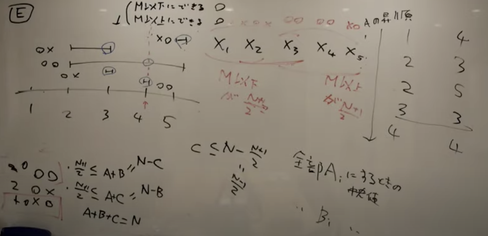

# [AtCoder Beginner Contest 169](https://atcoder.jp/contests/abc169/tasks)

## [E - Count Median](https://atcoder.jp/contests/abc169/tasks/abc169_e)
- 中央値とはソートした時の真ん中の数のこと．
    - 奇数の場合は真ん中の数．
    - 偶数の場合は真ん中に近い2つの数の平均値．
- 中央値の最小値は，全部 Ai にした時の中央値．
- 中央値の最大値は，全部 Bi にした時の中央値．
- それで，中央値を Ai から1ずつ増やして，Bi に持っていく時に，Ai から Bi の間には全部中央値が存在する．
- Ai から Bi の間に全部中央値が存在する証明のイメージ(N が奇数バージョン)はこんな感じ．

- それで，`(xo の個数) ≦ ((N - 1) / 2)`，`(ox の個数) ≦ ((N - 1) / 2)`で，
    - 中央値を0から max  まで1ずつ移動させていくと，`ox → oo → xo` の範囲を移行していく．
    - `ox` は，中央値より小さい範囲に持っていける `Ai ≤ Xi ≤ Bi`．
    - `oo` は，中央値より小さい範囲・大きい範囲両方に持っていける `Ai ≤ Xi ≤ Bi`．
    - `xo` は，中央値より大きい範囲に持っていける `Ai ≤ Xi ≤ Bi`．
- N が偶数の時もAi から Bi の間には全部中央値が存在します．

## [D - Div Game](https://atcoder.jp/contests/abc169/tasks/abc169_d)
- 素因数分解の問題．
- 各素因数の冪乗から 1, 2, 3, ... を引いた回数の合計が答えになる．

## [C - Multiplication 3](https://atcoder.jp/contests/abc169/tasks/abc169_c)
- 少数の取り扱いに気をつける問題．
- double 型で読み込んでから，100倍して，1/100倍する問題．

## [B - Multiplication 2](https://atcoder.jp/contests/abc169/tasks/abc169_b)
- 多倍長整数を扱う問題．
- `boost/multiprecision/cpp_int.hpp` ライブラリをインストールすれば使える．
    - Mac なら `brew install boost` でインストールできる．
